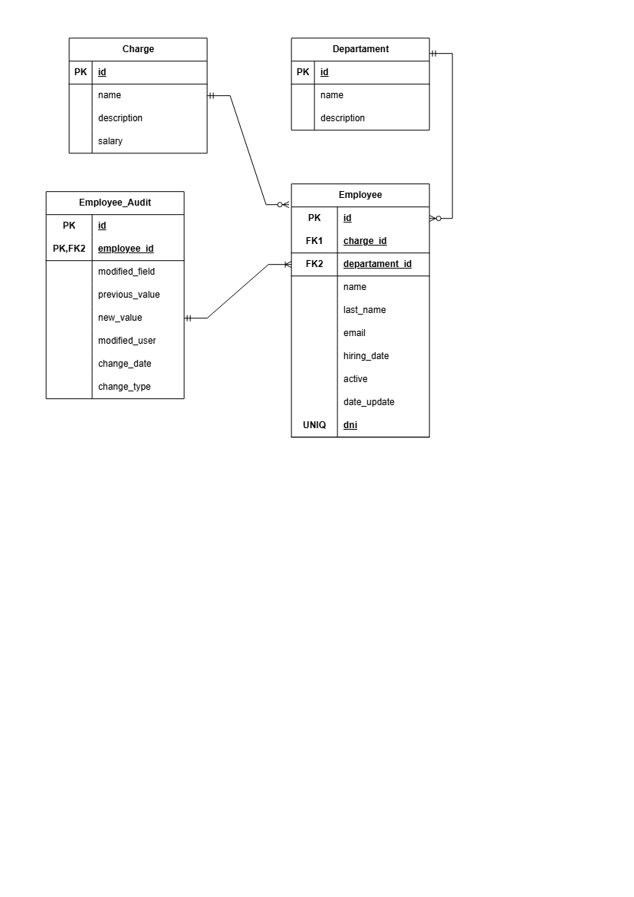

# 🛡️ Sistema de Auditoría de Empleados

## 📋 Descripción
Sistema de auditoría automática para una base de datos de empleados. Cada cambio (INSERT, UPDATE, DELETE) es registrado en una tabla de auditoría con:
- Qué campo cambió
- Valor anterior y nuevo
- Quién hizo el cambio
- Cuándo se hizo
- Tipo de operación

## 🎯 Habilidades demostradas
- ✅ Diseño de esquema normalizado
- ✅ Triggers DML (INSERT, UPDATE, DELETE)
- ✅ Vistas para reporting
- ✅ Funciones de ventana (ROW_NUMBER)
- ✅ Índices para optimización
- ✅ Gestión de integridad referencial

## 🗺️ Modelo de datos


## 🚀 Cómo ejecutar
1. Ejecuta `01_schema.sql` (crea BD y tablas)
2. Ejecuta `02_datos_prueba.sql` (carga datos iniciales)
3. Ejecuta `03_trigger_auditoria.sql` (crea triggers)
4. Ejecuta `04_vista_historico.sql` (crea vistas)
5. Ejecuta `05_pruebas_auditoria.sql` (prueba todo)

## 📊 Ejemplo de salida
```sql
-- Consultar historial completo
SELECT * FROM vw_HistorialEmpleados WHERE Id_Empleado = 1;

-- Resultado:
-- | Id_Auditoria | Campo_Modificado | Valor_Anterior | Valor_Nuevo | Fecha_Cambio |
-- |--------------|------------------|----------------|-------------|--------------|
-- | 1            | Salario          | 3500.00        | 3800.00     | 2026-08-12   |

##👤 Autor
-- Heydi Margarita Henry Chibas
